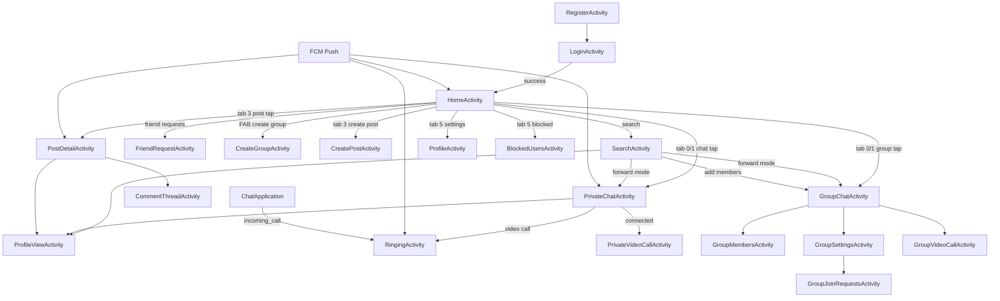

# TP CHAT — Functional Specification (Android Client)

Reverse-engineered from `Client/app/src/main/java/com/example/chatappjava/` and related manifest, network, database, and service layers. This document covers **functionality only** — not visual design.

---

# Product Overview

## Application purpose

**TP CHAT** is a mobile client for a full-stack messaging and social platform. It connects to a self-hosted Node.js backend (REST + Socket.IO + MongoDB) and provides:

- Account lifecycle (register, login, profile, security)
- Friend graph and user discovery
- Private and group real-time chat
- Voice/video calling (private 1:1 and group)
- Social feed (posts, comments, reactions, sharing)
- Push notifications (Firebase Cloud Messaging)
- Offline-first local cache with background sync

## Main user goals

| Goal | How the app supports it |
|------|-------------------------|
| Communicate 1:1 | Private chats, media messages, calls |
| Communicate in groups | Group creation, join requests, group chat, group calls |
| Build a friend network | Search users, send/accept friend requests, view friends |
| Share and consume content | Post feed, create posts, comment, like, share |
| Stay informed | In-app notifications tab + FCM push |
| Control privacy & account | Block users, report users, change password, delete account |
| Work offline / poor network | SQLite cache, pending message queue, sync on reconnect |

## Core business logic

1. **Session**: JWT bearer token stored in SQLite `app_settings`; all authenticated API calls include `Authorization: Bearer <token>`.
2. **Realtime**: Singleton `SocketManager` maintains one Socket.IO connection per logged-in user; messages, typing, calls, and feed events arrive via socket events.
3. **Chat model**: Server distinguishes `private` vs `group` chats. Groups have `groupId`, visibility (`public`/`private`), join-request workflow, and role-based admin actions.
4. **Messaging**: Messages support types `text`, `image`, `file`, `video`, `audio`, `voice`, `system`; support reply, edit, delete, reactions, mentions (groups), forward, and AI summarize (server-side).
5. **Calls**: Initiated via REST; media streamed over Socket.IO (`video_frame`, `audio_frame`) after joining a call room; incoming calls surfaced globally via `ChatApplication` → `RingingActivity`.
6. **Social**: Posts have privacy (`public`, `friends`, `only_me`), media galleries, tagging, likes, threaded comments, shares.
7. **Offline**: `DatabaseHelper` stores conversations, messages, calls, posts locally; `OfflineMessageSyncManager` + `SyncManager` + `SyncWorker` reconcile with server.

---

# Complete Feature Inventory

## Authentication

| Feature | Description |
|---------|-------------|
| Login | Email + password → JWT + user profile persisted locally |
| Register (OTP) | Request OTP → verify 6-digit code → account created |
| Register (legacy) | Direct `POST /api/auth/register` path exists in API client |
| Forgot password | Email OTP → verify OTP → set new password |
| Auto-login | If token exists in local DB, skip login → `HomeActivity` |
| Auth error handling | Socket auth failure broadcasts `AUTH_ERROR` → force logout |
| Logout | Clear local session; disconnect socket; navigate to login |

## User Management

| Feature | Description |
|---------|-------------|
| View own profile | `ProfileActivity` — edit username, name, phone, bio, avatar |
| View other profiles | `ProfileViewActivity` — friends list, posts, actions menu |
| Avatar upload | Multipart upload to `/api/auth/upload-avatar` |
| Change password | Current + new password via settings |
| Delete account | OTP email confirmation flow |
| Server config override | IP, port, HTTPS, WSS stored per-device in `app_settings` |

## Friends

| Feature | Description |
|---------|-------------|
| Send friend request | From search or profile |
| Accept / reject request | `FriendRequestActivity` |
| Cancel sent request | `DELETE /api/friend-requests/:id` |
| View friends list | Tab in `FriendRequestActivity` + profile screens |
| Unfriend | From chat options or home chat long-press menu |
| Friend request badge | Count on home chats tab |

## Private Messaging

| Feature | Description |
|---------|-------------|
| Create/open private chat | Auto-create via `POST /api/chats/private` |
| Send text | REST + socket echo |
| Send image | Camera or gallery → upload → image message |
| Send file | Document picker → upload → file message |
| Send voice | Hold-to-record → upload → voice message |
| Reply to message | Reply bar with quoted preview |
| Edit message | `PUT /api/messages/:id` |
| Delete message | `DELETE /api/messages/:id` |
| Message reactions | Emoji reactions add/remove |
| Forward message | Pick destination chat via `SearchActivity` forward mode |
| Typing indicator | Emit `typing` / `stop_typing`; display remote typers |
| Read/unread | Local + server `isRead` |
| Chat summarize | AI summary when enough new messages (`/api/messages/:chatId/summarize`) |
| Delete chat | Removes conversation for user |
| Block-aware UI | Disables compose when blocked |

## Group Messaging

| Feature | Description |
|---------|-------------|
| Create group | Name, description, public/private toggle, select friends |
| Group chat | Extends `BaseChatActivity` with mentions (`@user`) |
| Add members | Search users in add-members mode |
| Remove members | Owner/admin via `GroupMembersActivity` |
| Update member roles | Promote/demote admin/member |
| Leave group | Non-owner |
| Delete group | Owner hard-delete |
| Group avatar | Camera/gallery upload |
| Group settings | Public/private toggle, view info, join requests |
| Join public group | Direct join from discover/search |
| Request join private group | Pending until admin approves |
| Approve/reject join requests | `GroupJoinRequestsActivity` |
| Member removed realtime | Socket `member_removed` / `member_removed_from_group` |

## Calls

| Feature | Description |
|---------|-------------|
| Initiate private video call | From private chat → `RingingActivity` / `PrivateVideoCallActivity` |
| Receive incoming call | Socket `incoming_call` + FCM fallback → `RingingActivity` |
| Accept / decline | Swipe UI; REST `join` / `decline` |
| Cancel outgoing call | End call API from chat |
| Active call UI | Mute, camera toggle, switch camera, end call |
| Group video call | Start/join from group chat; passive alert banner |
| Call history | Home Calls tab; cached in SQLite |
| Call room | Socket `join_call_room` → `roomId` in `call_room_joined` |
| Media transport | Base64 `video_frame` / `audio_frame` over Socket.IO |

## Media Sharing (Chat)

| Type | Source | Upload path |
|------|--------|-------------|
| Image | Camera, gallery | `/api/upload/chat/:chatId/image` |
| File | Document picker | `/api/upload/chat/:chatId/file` |
| Voice | In-app recorder | Uploaded then sent as voice message |
| Avatar (user) | Image picker | `/api/auth/upload-avatar` |
| Avatar (group) | Camera/gallery | `/api/chats/:groupId/avatar` |
| Post media | Up to 20 images | `/api/upload/posts/image` |

## Posts & Social Feed

| Feature | Description |
|---------|-------------|
| Feed | Public + friends' posts, paginated |
| Create post | Text, images (up to 20), privacy, tags, location (UI present) |
| Share post to feed | Reshare with embedded original |
| Like/unlike | Toggle via API |
| Comment | Top-level and nested replies |
| Comment reactions | like, love, haha, wow, sad, angry |
| Tag users in post/comment | `@mention` with user picker |
| Edit/delete own post | From post options menu |
| Hide others' posts | `POST /api/posts/:id/hide` |
| Search posts | Full-text + filters (friends, media, hashtag, date) |
| Share externally | Android share sheet |
| Copy deep link | `chatapp://post/:id` |
| Send post as message | Share flow → pick chat |

## Notifications

| Feature | Description |
|---------|-------------|
| In-app notification list | Home Notifications tab |
| Types | `tagged_in_post`, `tagged_in_comment`, `friend_posted`, `friend_shared` |
| Mark as read | `PUT /api/notifications/:id/read` |
| FCM push | message, call, friend_request, post_notification |
| FCM token registration | `POST /api/users/me/fcm-token` |

## Profile Management

| Feature | Description |
|---------|-------------|
| Edit profile fields | username, firstName, lastName, phone, bio |
| View friends on profile | Horizontal/list |
| View user posts on profile | Paginated |
| Avatar zoom | Full-screen photo view |

## Settings

| Feature | Description |
|---------|-------------|
| Profile shortcut | → `ProfileActivity` |
| Change password | Dialog |
| Blocked users | → `BlockedUsersActivity` |
| Delete account | OTP flow |
| Server configuration | IP/port/HTTPS/WSS |
| Reset settings | Clear overrides |
| Help & support | Static contact info |
| Notification toggles | Push/sound/vibrate (UI only — not persisted) |

## Administration (client-side group admin)

| Action | Who |
|--------|-----|
| Change group privacy | Creator/admin |
| Manage join requests | Creator/admin |
| Add/remove members | Creator/admin |
| Transfer ownership | Creator |
| Delete group | Creator |
| Update member roles | Creator/admin |

## Security

| Feature | Description |
|---------|-------------|
| Block user | From profile or chat options |
| Unblock user | `BlockedUsersActivity` |
| Report user | Free-text report to `/api/reports` |
| Block filters chats | Blocked users hidden from chat list |
| Password requirements | Min 6 characters on change/register |

## Search

| Mode | Scope |
|------|-------|
| Users | `/api/users/search` |
| Groups | `/api/groups/search` |
| Discover groups | `/api/groups/public` |
| Posts | `/api/posts/search` with filters |
| Add members | User search excluding existing members |
| Forward | User/group search to pick destination |

## Presence / Online Status

| Capability | Status |
|------------|--------|
| `lastSeen` on User model | Parsed from API |
| Real-time online indicator | Not implemented client-side |
| Typing indicator | Implemented per chat |
| Socket connection state | Tracked in `SocketManager` |

## Additional Features

| Feature | Description |
|---------|-------------|
| Offline messaging | Queue with `clientNonce` deduplication |
| Background sync | WorkManager every 15 min |
| Foreground sync | On resume, every 2s throttle |
| Battery optimization prompt | On login for reliable push |
| Deep links | `chatapp://post/:id`, HTTP(S) `/post/:id` |
| App shortcut | Launcher shortcut → `HomeActivity` |
| Recent search history | Stored locally (posts search) |

---

# Complete Screen Inventory

## 1. LoginActivity (Launcher)

| Attribute | Detail |
|-----------|--------|
| **Purpose** | Authentication entry; hosts login and sign-up in one screen |
| **Entry points** | App launch; logout; delete account; auth error; `RegisterActivity` redirect |
| **User actions** | Sign in; switch to sign-up; register with OTP; forgot password OTP flow |
| **Data displayed** | Email/password fields; register fields; inline errors; OTP timer |
| **Dependencies** | `ApiClient`, `DatabaseManager`, `ChatApplication` (socket + FCM) |
| **Related screens** | `HomeActivity` (success); `RegisterActivity` (redirect only) |

## 2. RegisterActivity

| Attribute | Detail |
|-----------|--------|
| **Purpose** | Thin redirect to `LoginActivity` with sign-up mode |
| **Entry points** | Manifest only (legacy/deep link) |
| **User actions** | None (immediate redirect) |
| **Dependencies** | `LoginActivity` |
| **Related screens** | `LoginActivity` |

## 3. HomeActivity (Main Hub)

| Attribute | Detail |
|-----------|--------|
| **Purpose** | Primary shell with 6 tabs: Chats, Groups, Calls, Posts, Notifications, Settings |
| **Entry points** | Post-login; call end; FCM taps; app shortcut |
| **User actions** | Switch tabs; pull-to-refresh; search; friend requests; create group; create post; chat/call/post interactions; long-press chat options; share post; exit confirm on back |
| **Data displayed** | Chat list (filtered); call history; post feed; notifications; settings panel; friend request count; user avatar/name |
| **Dependencies** | `ApiClient`, repositories, `SocketManager`, `SyncManager`, multiple adapters |
| **Related screens** | All major feature screens |

## 4. SearchActivity

| Attribute | Detail |
|-----------|--------|
| **Purpose** | Universal search: users, groups, discover, posts; special modes for forward/add-members |
| **Entry points** | Home search icon; chat forward; group add members |
| **User actions** | Search with debounce; filter posts; tap user (profile/message/add friend); tap group (join/request); forward message; select members |
| **Data displayed** | Search results; recent searches; trending keywords; empty/hint states |
| **Dependencies** | `ApiClient`, `UserSearchAdapter`, `GroupSearchAdapter`, `PostSearchAdapter` |
| **Related screens** | `ProfileViewActivity`, `PrivateChatActivity`, `GroupChatActivity`, `CreateGroupActivity` |

## 5. FriendRequestActivity

| Attribute | Detail |
|-----------|--------|
| **Purpose** | Manage incoming/outgoing requests and view friends |
| **Entry points** | Home friend requests banner |
| **User actions** | Accept/reject/cancel requests; search; open friend profile |
| **Data displayed** | Request list; friends list; tabs |
| **Dependencies** | `FriendRequestAdapter`, `FriendsAdapter`, `ApiClient` |
| **Related screens** | `ProfileViewActivity` |

## 6. PrivateChatActivity

| Attribute | Detail |
|-----------|--------|
| **Purpose** | 1:1 messaging and video call initiation |
| **Entry points** | Home chat tap; search; FCM message notification; forward |
| **User actions** | All `BaseChatActivity` actions; video call; cancel call; view profile; unfriend; delete chat |
| **Data displayed** | Messages; typing; reply bar; offline indicator; summarize prompt |
| **Dependencies** | `BaseChatActivity`, `SocketManager`, `MessageRepository` |
| **Related screens** | `ProfileViewActivity`, `PrivateVideoCallActivity`, `RingingActivity`, `SearchActivity` |

## 7. GroupChatActivity

| Attribute | Detail |
|-----------|--------|
| **Purpose** | Group messaging, mentions, group calls |
| **Entry points** | Home groups tab; search join |
| **User actions** | All base chat actions; `@mentions`; start/join group call; group options (members, settings, leave, delete) |
| **Data displayed** | Group messages; active call banner; member count |
| **Dependencies** | `BaseChatActivity`, group call socket listeners |
| **Related screens** | `GroupMembersActivity`, `GroupSettingsActivity`, `GroupVideoCallActivity` |

## 8. BaseChatActivity (Abstract — incorrectly in manifest)

| Attribute | Detail |
|-----------|--------|
| **Purpose** | Shared chat engine for private and group |
| **Not directly launchable** | Abstract class; manifest entry is dead |

## 9. CreateGroupActivity

| Attribute | Detail |
|-----------|--------|
| **Purpose** | Create new group with selected friends |
| **Entry points** | Home FAB on Chats/Groups tabs |
| **User actions** | Enter name/description; toggle public; search friends; select members; create |
| **Data displayed** | Friends checklist |
| **Dependencies** | `SelectableUserAdapter`, `ApiClient` |
| **Related screens** | `GroupChatActivity` (on success) |

## 10. GroupMembersActivity

| Attribute | Detail |
|-----------|--------|
| **Purpose** | View/search members; admin actions |
| **Entry points** | Group chat options; group settings |
| **User actions** | Search members; remove member; change role; add members (→ search) |
| **Data displayed** | Member list with roles |
| **Dependencies** | `GroupMembersAdapter`, `ApiClient` |
| **Related screens** | `SearchActivity` (add_members mode) |

## 11. GroupSettingsActivity

| Attribute | Detail |
|-----------|--------|
| **Purpose** | Group metadata and admin settings |
| **Entry points** | Group chat options |
| **User actions** | View info; change avatar; toggle public/private; join requests; leave; delete; transfer ownership |
| **Data displayed** | Group name; privacy; pending request count |
| **Dependencies** | `ApiClient`, role-based permissions |
| **Related screens** | `GroupJoinRequestsActivity`, `GroupMembersActivity` |

## 12. GroupJoinRequestsActivity

| Attribute | Detail |
|-----------|--------|
| **Purpose** | Approve/reject pending join requests |
| **Entry points** | Group settings / home group options (owner) |
| **User actions** | Search; approve; reject |
| **Data displayed** | Requesting users |
| **Dependencies** | `MessageAdapter.RequestsAdapter` |
| **Related screens** | `GroupSettingsActivity` |

## 13. ProfileActivity (Own Profile)

| Attribute | Detail |
|-----------|--------|
| **Purpose** | Edit and view own profile, friends, posts |
| **Entry points** | Home avatar; Settings |
| **User actions** | Edit fields; change avatar; save; view friends/posts |
| **Data displayed** | Profile fields; friends; own posts |
| **Dependencies** | `ApiClient`, `PostAdapter`, `FriendsAdapter` |
| **Related screens** | `ProfileViewActivity`, `PostDetailActivity` |

## 14. ProfileViewActivity (Other User)

| Attribute | Detail |
|-----------|--------|
| **Purpose** | View another user's profile and interact |
| **Entry points** | Search; chat header; post author; tagged users; friends list |
| **User actions** | Send friend request; message (create chat); block/unblock; report; view friends/posts |
| **Data displayed** | User info; friends; posts |
| **Dependencies** | `ApiClient` |
| **Related screens** | `PrivateChatActivity`, `PostDetailActivity` |

## 15. SettingsActivity

| Attribute | Detail |
|-----------|--------|
| **Purpose** | Standalone settings (duplicate of Home Settings tab content) |
| **Entry points** | Rarely used directly; `SettingsAdapter` duplicates logic inline |
| **User actions** | Same as Settings tab |
| **Related screens** | `ProfileActivity`, `BlockedUsersActivity`, `LoginActivity` |

## 16. BlockedUsersActivity

| Attribute | Detail |
|-----------|--------|
| **Purpose** | List and unblock users |
| **Entry points** | Settings |
| **User actions** | Unblock |
| **Data displayed** | Blocked user list |
| **Dependencies** | `BlockedUsersAdapter`, `ApiClient` |

## 17. CreatePostActivity

| Attribute | Detail |
|-----------|--------|
| **Purpose** | Compose and publish posts |
| **Entry points** | Home posts tab; share-to-feed |
| **User actions** | Add text/media; tag people; set privacy; publish; share embedded post |
| **Data displayed** | Composer; media preview; tagged users; privacy |
| **Dependencies** | `ApiClient`, image picker |
| **Related screens** | `HomeActivity` (return) |

## 18. PostDetailActivity

| Attribute | Detail |
|-----------|--------|
| **Purpose** | Full post view with comments thread |
| **Entry points** | Feed tap; notification; deep link; share |
| **User actions** | Like; comment; reply; react; share; edit/delete (own); hide |
| **Data displayed** | Post; comments; reactions |
| **Dependencies** | `CommentAdapter`, `ApiClient` |
| **Related screens** | `CommentThreadActivity`, `ProfileViewActivity` |

## 19. CommentThreadActivity

| Attribute | Detail |
|-----------|--------|
| **Purpose** | Focused comment/reply thread |
| **Entry points** | Post detail reply tap |
| **User actions** | View replies; add reply; react; delete |
| **Dependencies** | `CommentAdapter` |

## 20. PostFeedActivity (Manifest only — **missing source**)

Declared in manifest; **no Java source file exists**.

## 21. RingingActivity

| Attribute | Detail |
|-----------|--------|
| **Purpose** | Incoming/outgoing call ringing UI |
| **Entry points** | `ChatApplication` global listener; FCM call push; outgoing from chat |
| **User actions** | Swipe accept/decline; auto-decline timeout |
| **Data displayed** | Caller info; call type; ringing animation |
| **Dependencies** | `ApiClient`, `SocketManager` |
| **Related screens** | `PrivateVideoCallActivity`, `HomeActivity` |

## 22. PrivateVideoCallActivity

| Attribute | Detail |
|-----------|--------|
| **Purpose** | Active 1:1 video call |
| **Entry points** | Accept call; initiate from private chat |
| **User actions** | Mute; camera on/off; switch camera; end call |
| **Data displayed** | Local/remote video frames; duration |
| **Dependencies** | `CameraCaptureManager`, `AudioCaptureManager`, `SocketManager` |
| **Related screens** | `HomeActivity` |

## 23. GroupVideoCallActivity

| Attribute | Detail |
|-----------|--------|
| **Purpose** | Active group video call with multiple participants |
| **Entry points** | Group chat call start/join |
| **User actions** | Mute; camera; switch camera; view participants; end call |
| **Dependencies** | `CustomVideoParticipantAdapter`, socket media frames |
| **Related screens** | `GroupChatActivity`, `HomeActivity` |

## 24. FilePreviewActivity (Manifest only — **missing source**)

Declared; **no Java source file**.

## 25. PrivateChatActivityNew (Manifest only — **missing source**)

Declared; **no Java source file**.

---

# Navigation Map

## Main flows

1. **Auth**: `LoginActivity` → `HomeActivity`
2. **Messaging**: `HomeActivity` → `PrivateChatActivity` / `GroupChatActivity`
3. **Social**: `HomeActivity` (Posts) → `PostDetailActivity` → `CommentThreadActivity`
4. **Calls**: Chat → `RingingActivity` → `PrivateVideoCallActivity` / `GroupVideoCallActivity` → `HomeActivity`
5. **Discovery**: `HomeActivity` → `SearchActivity` → `ProfileViewActivity` → chat or friend request

## Secondary flows

- Profile editing: `HomeActivity` → `ProfileActivity`
- Group admin: `GroupChatActivity` → `GroupSettingsActivity` → `GroupJoinRequestsActivity`
- Account deletion: Settings → OTP dialog → `LoginActivity`
- Server config: Settings dialog → restart required

## Deep links

| URI | Target | Data |
|-----|--------|------|
| `chatapp://post/:postId` | `PostDetailActivity` | `postId` from path |
| `http(s)://<server>/post/:id` | `PostDetailActivity` | Hardcoded host in manifest |
| FCM `post_notification` | `PostDetailActivity` or Home posts tab | `postId` |
| FCM `friend_request` | `HomeActivity` | `openTab=friendRequests` |

## Modal flows (Dialogs)

| Dialog | Context |
|--------|---------|
| OTP (register, password reset, delete account) | Auth, settings |
| Change password | Settings |
| Server config | Settings |
| Chat options | Home long-press, chat more menu |
| Post options / share | Feed, post detail |
| Reaction picker | Messages, comments |
| Image zoom / gallery | Chat, posts |
| Voice recording | Chat |
| Emoji picker | Chat |
| Attachment picker | Chat (camera/gallery/file) |
| Confirm (logout, delete, block, unfriend) | `DialogUtils` |
| Edit post | Home/posts |
| Tagged users | Posts |
| Group info | Group settings |
| Participants list | Group video call |
| Report user | Profile view |

## Bottom sheets

No dedicated `BottomSheetDialogFragment` classes; options use `AlertDialog` with custom layouts.

---

# User Flows

## Registration

1. Open app → `LoginActivity`
2. Switch to Sign Up tab
3. Enter username, email, password, confirm password
4. Tap Register → `POST /api/auth/register/request-otp`
5. Enter 6-digit OTP (60s timer)
6. `POST /api/auth/register/verify-otp` → token saved
7. Socket reconnect + FCM register → `HomeActivity`

## Login

1. Enter email + password → `POST /api/auth/login`
2. Save token + user to SQLite
3. Reconnect socket, register FCM, battery optimization prompt
4. Navigate to `HomeActivity`

## Forgot Password

1. Tap "Forgot password" on login
2. Enter email → request OTP
3. Verify OTP → enter new password
4. `POST /api/auth/password/reset` → return to login

## Add Friend

1. `SearchActivity` → Users tab → search
2. Tap user → `ProfileViewActivity`
3. More menu → Send Friend Request
4. `POST /api/friend-requests` with `receiverId`

## Accept Friend Request

1. Home → Friend Requests banner → `FriendRequestActivity`
2. Requests tab → Accept
3. `PUT /api/friend-requests/:id` with `action: accept`

## Start Private Chat

1. From `ProfileViewActivity` → Message, or Search → user with existing friendship
2. `POST /api/chats/private` with `participantId` (if new)
3. Open `PrivateChatActivity` with chat JSON extra

## Create Group

1. Home → FAB (Chats or Groups tab)
2. `CreateGroupActivity` → name, description, public toggle, select friends
3. `POST /api/chats/group`
4. Open `GroupChatActivity`

## Join Group

**Public**: Search/Discover → tap Join → `POST /api/groups/:id/join`

**Private**: Search → Request Join → `POST /api/groups/:id/join-requests` → admin approves in `GroupJoinRequestsActivity`

## Send Message

1. Open chat → type text → send
2. Generate `clientNonce` → save pending to SQLite
3. `POST /api/messages` → on success mark synced; socket broadcasts to recipients
4. If offline: queue locally; sync on reconnect via `OfflineMessageSyncManager`

## Send Image

1. Tap attachment → Camera or Gallery
2. Upload to `/api/upload/chat/:chatId/image`
3. Send image message with returned URL

## Send File / Voice

- **File**: attachment → file picker → upload → file message
- **Voice**: hold record button → stop → upload audio → voice message

## Start Video Call (Private)

1. Private chat → video call button
2. `POST /api/calls/initiate` with `type: video`
3. Launch `PrivateVideoCallActivity` (caller) or wait for callee's `RingingActivity`

## Receive Video Call

1. Socket `incoming_call` (or FCM `type: call`)
2. `ChatApplication` / FCM launches `RingingActivity`
3. Swipe accept → `POST /api/calls/:id/join` → `join_call_room` → `PrivateVideoCallActivity`
4. Swipe decline → `POST /api/calls/:id/decline`

## Start Group Video Call

1. Group chat → video call
2. Check active calls → initiate or join existing
3. `GroupVideoCallActivity` with participant grid
4. Passive members see `group_call_passive_alert` banner

## Logout

1. Settings → Logout → confirm
2. `clearLoginInfo()`; socket disconnect
3. `LoginActivity` with cleared task

## Additional flows

- **Forward message**: Message long-press → forward → `SearchActivity` (forward mode) → pick chat
- **Reply**: Long-press → reply → compose with reply bar
- **Edit message**: Long-press own message → edit
- **React**: Long-press → emoji picker → add/remove reaction
- **Summarize chat**: Tap summarize indicator when ≥ threshold new messages
- **Block user**: Chat options or profile → confirm → `PUT /api/users/:id/block`
- **Report user**: Profile more → report text → `POST /api/reports`
- **Delete account**: Settings → OTP → `DELETE /api/auth/me/confirm`
- **Share post**: Share dialog → feed / message / copy link / external

---

# Component Inventory

## Adapters (RecyclerView)

| Component | Purpose |
|-----------|---------|
| `ChatListAdapter` | Chat/group list items with last message, unread |
| `CallListAdapter` | Call history entries |
| `MessageAdapter` | Chat messages (text, image, file, voice, reactions, reply) |
| `FriendsAdapter` | Friend list rows |
| `FriendRequestAdapter` | Incoming/outgoing requests with actions |
| `GroupMembersAdapter` | Group member with role badges |
| `GroupSearchAdapter` | Group search/discover results |
| `UserSearchAdapter` | User search results |
| `PostAdapter` | Feed post cards with media, actions |
| `PostSearchAdapter` | Post search results |
| `PostGalleryAdapter` | Multi-image gallery in posts |
| `CommentAdapter` | Comments and nested replies |
| `NotificationAdapter` | In-app notification items |
| `SettingsAdapter` | Embedded settings panel in Home tab |
| `SelectableUserAdapter` | Checkbox user picker (create group) |
| `TagUserAdapter` | Tagged users list |
| `MentionSuggestionAdapter` | `@mention` autocomplete |
| `ReactionUserAdapter` | Users who reacted |
| `ImagePagerAdapter` | Full-screen image swipe |
| `VideoParticipantAdapter` | Group call participant tiles |
| `CustomVideoParticipantAdapter` | Extended participant rendering |
| `BlockedUsersAdapter` | Blocked user with unblock action |

## Functional UI Components

| Component | Purpose |
|-----------|---------|
| User Avatar loader | `AvatarManager` — cached image loading |
| Search Input | Debounced search in `SearchActivity`, member search |
| Friend Card | `FriendsAdapter` item |
| Chat Item | `ChatListAdapter` item |
| Message Item | `MessageAdapter` view types by message type |
| Group Item | `ChatListAdapter` (group filter) |
| Notification Item | `NotificationAdapter` |
| File Attachment Item | Message file row with open/download |
| Video Renderer | `ImageView` + bitmap decode from socket frames |
| Call Controls | Mute, camera, switch, end in call activities |
| Settings Item | Options rows in `SettingsAdapter` |
| Offline Indicator | Banner in chat when no network |
| Typing Indicator | Subtitle replacement in chat header |
| Reply Bar | Quoted message preview above composer |
| Summarize Indicator | Prompt for AI chat summary |
| Scroll-to-bottom button | New message counter when scrolled up |
| SwipeRefreshLayout | Pull-to-refresh on home tabs |
| Create Post Bar | Embedded in posts RecyclerView |
| Group Call Notification Bar | Join active call banner in group chat |
| OTP Circles | 6-digit OTP entry UI |
| Recording Dialog | Voice message capture with timer |

## Dialog Types

`ReactionPickerDialog`, chat options, post options, share post, edit post, tagged users, change password, server config, delete confirm, image select, emoji picker, attachment options, image zoom, group info, participants list, report user, exit confirm, avatar zoom

## Services & Background

| Component | Purpose |
|-----------|---------|
| `ChatFirebaseMessagingService` | FCM message routing |
| `SyncWorker` | Periodic 15-min background sync |
| `ChatApplication` | Global socket + incoming call routing |

## Utilities

| Component | Purpose |
|-----------|---------|
| `DatabaseManager` | Session + settings key-value store |
| `DatabaseHelper` | SQLite schema |
| `MessageRepository` | Message CRUD |
| `ConversationRepository` | Chat list cache |
| `PostRepository` | Post cache |
| `CallRepository` | Call history cache |
| `OfflineMessageSyncManager` | Pending message upload |
| `SyncManager` | Delta sync orchestration |
| `DialogUtils` | Standard confirm dialogs |
| `BatteryOptimizationHelper` | Prompt to disable battery restrictions |
| `UrlUtils` | Avatar URL resolution |
| `ReplyPreviewCache` | Reply thumbnail cache |
| `CameraCaptureManager` | Video frame capture |
| `AudioCaptureManager` / `AudioPlaybackManager` | Call audio |
| `VideoFrameEncoder` / `AudioFrameEncoder` | Base64 encoding for socket |

---

# Data Model Inventory

## User

| Field | Type | Usage |
|-------|------|-------|
| id | String | Primary key |
| username, email | String | Identity |
| avatar | String | Profile image path |
| firstName, lastName, bio, phoneNumber | String | Profile (nested `profile` in API) |
| lastSeen | long | Presence timestamp |
| isFriend, friendshipStatus | boolean/String | Relationship state |
| friendRequestStatus, friendRequestId | String | Pending request metadata |

**Relationships**: friends (many-to-many); blocked users; post author; message sender

## FriendRequest

| Field | Type | Usage |
|-------|------|-------|
| id | String | Request ID |
| senderId, receiverId | String | Parties |
| status | String | pending/accepted/rejected |
| sender, receiver | User | Populated objects |

## Chat (Conversation)

| Field | Type | Usage |
|-------|------|-------|
| id | String | Chat ID |
| type | String | private / group |
| groupId | String | Linked server group |
| name, description, avatar | String | Group metadata |
| participants / participantIds | List | Members |
| otherParticipant | User | Private chat peer |
| lastMessage, lastMessageTime | String/long | List preview |
| unreadCount | int | Badge |
| visibility, isPublic | String/boolean | Join policy |
| joinRequestStatus | String | User's pending join |
| creatorId | String | Owner |
| createdAt, updatedAt | long | Timestamps |

**SQLite table**: `conversations`

## Message

| Field | Type | Usage |
|-------|------|-------|
| id | String | Server message ID |
| chatId | String | Parent chat |
| senderId, senderDisplayName, senderAvatarUrl | String | Author |
| content | String | Text or URL |
| type | String | text/image/file/voice/etc. |
| chatType | String | private/group |
| timestamp | long | Ordering |
| isRead, isDeleted, edited, editedAt | bool/long | State |
| attachments | JSON | Media metadata |
| replyTo* | String | Reply reference |
| reactions / reactionSummary | Map/JSON | Emoji counts |
| clientNonce | String | Offline dedup |
| syncStatus | String | synced/pending/failed (local) |

**SQLite table**: `messages`

## Call

| Field | Type | Usage |
|-------|------|-------|
| callId | String | Call session ID |
| type | String | audio/video |
| chatId, chatName, chatType | String | Context |
| status | String | initiated/ringing/active/ended/declined/missed/cancelled |
| startedAt, endedAt, duration | long/int | Timing |
| isGroupCall | boolean | Group vs private |
| callerId, callerName, callerAvatar | String | Initiator |
| participants | List\<CallParticipant\> | Members |

**SQLite table**: `calls`

## CallParticipant

| Field | Usage |
|-------|-------|
| userId, username, avatar | Identity |
| isCaller | Boolean |
| joinedAt, leftAt | Timing |

## Post

| Field | Type | Usage |
|-------|------|-------|
| id | String | Post ID |
| authorId, authorUsername, authorAvatar | String | Author |
| content | String | Text body |
| mediaUrls, mediaType | List/String | image/video/gallery/none |
| timestamp | long | Created |
| likesCount, commentsCount, sharesCount | int | Engagement |
| isLiked, reactionType | bool/String | Viewer state |
| sharedPostId, sharedPost | String/Post | Reshare |
| taggedUsers | List\<User\> | Mentions |

**SQLite table**: `posts`

## Comment

| Field | Type | Usage |
|-------|------|-------|
| id, userId, username, userAvatar | String | Identity |
| content | String | Text |
| parentCommentId | String | Threading |
| replies | List\<Comment\> | Nested |
| likesCount, isLiked | int/bool | Engagement |
| reactions, currentUserReaction | List/String | Emoji reactions |
| mediaUrl | String | Attachment |
| isEdited | boolean | Edit state |

## Notification

| Field | Type | Usage |
|-------|------|-------|
| id | String | Notification ID |
| type | String | tagged_in_post, tagged_in_comment, friend_posted, friend_shared |
| actorId, actorUsername, actorAvatar | String | Who triggered |
| postId, commentId | String | Related content |
| postPreviewImage | String | Thumbnail |
| timestamp, isRead | long/bool | State |

## SyncMetadata (local)

| Field | Usage |
|-------|-------|
| resource_type | messages/posts/users/conversations |
| last_sync_timestamp | Delta sync cursor |
| last_sync_success, last_sync_error | Health |

## AppSettings (local key-value)

| Keys | Usage |
|------|-------|
| token, userId, userInfo | Session |
| isLoggedIn | Auth gate |
| overrideServerIp/Port/UseHttps/UseWss | Server override |

---

# Backend/API Inventory

## REST Endpoints (used by Android client)

### Authentication
| Method | Endpoint | Purpose |
|--------|----------|---------|
| POST | `/api/auth/login` | Login |
| POST | `/api/auth/register` | Direct register |
| POST | `/api/auth/register/request-otp` | Registration OTP |
| POST | `/api/auth/register/verify-otp` | Complete registration |
| POST | `/api/auth/password/request-reset` | Password reset OTP |
| POST | `/api/auth/password/verify-otp` | Verify reset OTP |
| POST | `/api/auth/password/reset` | Set new password |
| GET | `/api/auth/me` | Current user |
| PUT | `/api/auth/profile` | Update profile |
| PUT | `/api/auth/change-password` | Change password |
| POST | `/api/auth/logout` | Logout |
| DELETE | `/api/auth/me` | Delete account (password) |
| POST | `/api/auth/delete/request-otp` | Delete account OTP |
| DELETE | `/api/auth/me/confirm` | Confirm delete with OTP |
| POST | `/api/auth/upload-avatar` | Avatar upload |

### Users
| Method | Endpoint | Purpose |
|--------|----------|---------|
| GET | `/api/users/search?q=` | Search users |
| GET | `/api/users/:id` | User profile |
| GET | `/api/users/friends` | My friends |
| GET | `/api/users/:id/friends` | User's friends |
| DELETE | `/api/users/:id/friends` | Unfriend |
| PUT | `/api/users/:id/block` | Block/unblock |
| GET | `/api/users/blocked` | Blocked list |
| POST | `/api/users/me/fcm-token` | Register FCM |
| DELETE | `/api/users/me/fcm-token` | Remove FCM |

### Friend Requests
| Method | Endpoint | Purpose |
|--------|----------|---------|
| POST | `/api/friend-requests` | Send request |
| GET | `/api/friend-requests` | List requests |
| PUT | `/api/friend-requests/:id` | Accept/reject |
| DELETE | `/api/friend-requests/:id` | Cancel |

### Chats
| Method | Endpoint | Purpose |
|--------|----------|---------|
| GET | `/api/chats` | List chats |
| POST | `/api/chats/private` | Create private chat |
| POST | `/api/chats/group` | Create group |
| DELETE | `/api/chats/:id` | Delete chat |
| POST | `/api/chats/:id/leave` | Leave group |
| GET/POST/DELETE | `/api/chats/:id/members` | Member CRUD |
| PUT | `/api/chats/:id/members/role` | Role update |
| PUT | `/api/chats/:id/settings` | Group settings |
| PUT | `/api/chats/:id/owner` | Transfer ownership |
| POST | `/api/chats/:id/avatar` | Group avatar |

### Groups
| Method | Endpoint | Purpose |
|--------|----------|---------|
| GET | `/api/groups/search?q=` | Search groups |
| GET | `/api/groups/public` | Discover public |
| POST | `/api/groups/:id/join` | Join public |
| POST | `/api/groups/:id/join-requests` | Request join |
| DELETE | `/api/groups/:id/join-requests` | Cancel request |
| GET | `/api/groups/:id/join-requests` | List requests |
| GET | `/api/groups/:id/join-requests/count` | Pending count |
| POST | `/api/groups/:id/join-requests/:userId` | Approve/reject |
| DELETE | `/api/groups/:id` | Delete group |

### Messages
| Method | Endpoint | Purpose |
|--------|----------|---------|
| POST | `/api/messages` | Send message |
| GET | `/api/messages/:chatId?page&limit` | Paginated history |
| PUT | `/api/messages/:id` | Edit |
| DELETE | `/api/messages/:id` | Delete |
| POST | `/api/messages/:id/reactions` | Add reaction |
| DELETE | `/api/messages/:id/reactions` | Remove reaction |
| GET | `/api/messages/:chatId/summarize` | AI summary |

### Uploads
| Method | Endpoint | Purpose |
|--------|----------|---------|
| POST | `/api/upload/chat/:chatId/image` | Chat image |
| POST | `/api/upload/chat/:chatId/file` | Chat file |
| POST | `/api/upload/posts/image` | Post image |

### Calls
| Method | Endpoint | Purpose |
|--------|----------|---------|
| POST | `/api/calls/initiate` | Start call |
| POST | `/api/calls/:id/join` | Join |
| POST | `/api/calls/:id/decline` | Decline |
| POST | `/api/calls/:id/leave` | Leave |
| POST | `/api/calls/:id/end` | End |
| GET | `/api/calls/:id` | Details |
| GET | `/api/calls/history` | History |
| GET | `/api/calls/active` | Active calls |
| PUT | `/api/calls/:id/settings` | Call settings |

### Posts
| Method | Endpoint | Purpose |
|--------|----------|---------|
| POST | `/api/posts` | Create |
| GET | `/api/posts/feed` | Feed |
| GET | `/api/posts/user/:userId` | User posts |
| GET | `/api/posts/:id` | Single post |
| GET | `/api/posts/search` | Search with filters |
| PUT | `/api/posts/:id` | Update |
| DELETE | `/api/posts/:id` | Delete |
| POST | `/api/posts/:id/hide` | Hide from feed |
| POST | `/api/posts/:id/like` | Toggle like |
| POST | `/api/posts/:id/comments` | Add comment |
| DELETE | `/api/posts/:id/comments/:commentId` | Delete comment |
| POST/DELETE | `/api/posts/:id/comments/:commentId/reactions` | Comment reactions |
| POST | `/api/posts/:id/share` | Share to feed |

### Notifications & Reports
| Method | Endpoint | Purpose |
|--------|----------|---------|
| GET | `/api/notifications` | List |
| PUT | `/api/notifications/:id/read` | Mark read |
| POST | `/api/reports` | Report user |

## WebSocket Events (Socket.IO)

### Client → Server (emit)
| Event | Payload | Purpose |
|-------|---------|---------|
| `typing` | `{ chatId }` | Start typing |
| `stop_typing` | `{ chatId }` | Stop typing |
| `join_call_room` | `{ callId }` | Enter call media room |
| `leave_call_room` | `{ callId }` | Exit call room |
| `video_frame` | `{ callId, frame, timestamp }` | Send video |
| `audio_frame` | `{ callId, audio, timestamp }` | Send audio |

### Server → Client (on)
| Event | Purpose |
|-------|---------|
| `private_message` | New private message |
| `group_message` | New group message |
| `message_edited` | Message updated |
| `message_deleted` | Message removed |
| `reaction_updated` | Reaction change |
| `user_typing` / `user_stop_typing` | Typing indicators |
| `incoming_call` | 1:1 incoming call |
| `call_accepted` / `call_declined` / `call_ended` | Call state |
| `call_room_joined` | Call room joined with `roomId` |
| `video_frame` / `audio_frame` | Remote media |
| `member_removed` / `member_removed_from_group` | Group membership |
| `new_post` | Feed update |
| `avatar_changed` | Profile avatar update |
| `group_call_passive_alert` | Passive group call notice |
| `group_call_passive_alert_broadcast` | Broadcast variant |
| `group_call_started` | Group call began |
| `group_call_participant_joined` / `_left` | Participant changes |

**Auth**: Socket connects with `auth: { token }` in handshake options.

## Firebase

| Item | Detail |
|------|--------|
| Service | `ChatFirebaseMessagingService` |
| Token registration | `POST /api/users/me/fcm-token` with `platform: android` |
| Data payload types | `message`, `call`, `friend_request`, `post_notification` |
| Default channel | `default` (high importance) |

**No Firebase Realtime Database or Firestore** — FCM only for push delivery.

## Storage Paths (server-side, referenced by client)

| Path pattern | Content |
|--------------|---------|
| `/uploads/avatars/` | User avatars |
| `/uploads/chat/:chatId/` | Chat images and files |
| `/uploads/posts/` | Post images |

## Authentication Flow

1. Login/register → receive JWT
2. Store in SQLite `app_settings`
3. All REST: `Authorization: Bearer <token>`
4. Socket: `auth.token` on connect
5. On 401 or socket auth error → clear session → login

---

# Permissions Inventory

| Permission | Why needed |
|------------|------------|
| `INTERNET` | API and Socket.IO |
| `ACCESS_NETWORK_STATE` | Offline detection, sync gating |
| `CAMERA` | Photos, video calls |
| `RECORD_AUDIO` | Voice messages, calls |
| `MODIFY_AUDIO_SETTINGS` | Call audio routing |
| `READ_EXTERNAL_STORAGE` | Legacy file/gallery access (≤API 28) |
| `WRITE_EXTERNAL_STORAGE` | Legacy saves (≤API 28) |
| `READ_MEDIA_IMAGES` | Gallery images (API 33+) |
| `READ_MEDIA_VIDEO` | Video picker |
| `READ_MEDIA_AUDIO` | Audio files |
| `POST_NOTIFICATIONS` | Android 13+ notification display |
| `com.google.android.c2dm.permission.RECEIVE` | FCM delivery |
| `REQUEST_IGNORE_BATTERY_OPTIMIZATIONS` | Reliable background push |
| `DOWNLOAD_WITHOUT_NOTIFICATION` | Silent file downloads |

Runtime permission requests: camera, storage/media, record audio (in chat and call flows).

---

# State Inventory

| Screen | Loading | Empty | Error | Success | Offline |
|--------|---------|-------|-------|---------|---------|
| LoginActivity | Button disable during request | N/A | Inline error text | Navigate home | Network error toast |
| HomeActivity (Chats) | Swipe refresh, polling | `homeEmptyState` title/subtitle | Toast; auth redirect | Chat list populated | Show cached chats; sync on reconnect |
| HomeActivity (Groups) | Same | Empty groups message | Same | Group list | Cached |
| HomeActivity (Calls) | Load spinner | No calls | Failed load toast | Call history | SQLite cache first |
| HomeActivity (Posts) | Feed load | No posts | Parse/network error | Post feed | Cached posts via `PostRepository` |
| HomeActivity (Notifications) | Load | No notifications | Failed | List with unread | N/A |
| HomeActivity (Settings) | N/A | N/A | N/A | Settings rendered | N/A |
| SearchActivity | `progressBar` | `tvNoResults`, `tvSearchHint` | Failed search toast | Results list | Search requires network |
| FriendRequestActivity | `progressBar` | `tvNoRequests` | Load failure toast | Requests/friends shown | N/A |
| PrivateChatActivity / GroupChatActivity | `progressBar`, pagination | `tvMessagesEmpty` | Send fail; retry pending | Messages displayed | `offlineIndicator`; queue pending messages |
| CreateGroupActivity | `progressBar` | No friends | Load/create fail | Navigate to group chat | Friends load fails |
| GroupMembersActivity | Load | `empty_state` | API fail | Member list | N/A |
| GroupJoinRequestsActivity | `progressBar` | Empty list | Parse/action fail | Requests list | N/A |
| ProfileActivity | `progressBar` | `tvNoFriends`, `tvNoPosts` | Save/upload fail | Profile saved | N/A |
| ProfileViewActivity | Load | No friends/posts | Fetch fail | Profile + actions | N/A |
| BlockedUsersActivity | `progressBar` | `empty_state` | Load/unblock fail | List shown | N/A |
| CreatePostActivity | `ProgressDialog` | Disabled post button | Upload/create fail | Return to home | Cannot post offline |
| PostDetailActivity | Load | No comments | API errors | Post + comments | N/A |
| RingingActivity | Verify call status | N/A | Auto-navigate home if ended | Accept → call screen | Verify fails gracefully |
| PrivateVideoCallActivity | `loadingOverlay` | N/A | Frame timeout | Active call | Call may degrade |
| SettingsActivity | Progress dialogs | N/A | Network/OTP errors | Settings saved | N/A |

---

# Missing Functionality Analysis

## Incomplete features

| Feature | Evidence |
|---------|----------|
| Live streaming | Toast: "Live streaming coming soon" |
| Share to Story | Share dialog stub |
| Share to Group (from post) | Share dialog stub |
| Notification preferences persistence | `TODO: Save notification preference` in settings |
| Settings logout/socket disconnect | `SettingsAdapter` logout clears DB but may not call `ChatApplication.disconnectSocket()` |
| Audio-only call UI | `callType: voice` in FCM but primary flow is video |
| Online/presence indicator | `lastSeen` parsed but not displayed live |
| Post location tagging | UI fields exist; limited backend integration visible |
| `sendAsMessage` post share | Sets intent to Home with `action=share_post` — flow may be incomplete |

## Dead code / manifest orphans

| Item | Issue |
|------|-------|
| `PrivateChatActivityNew` | In manifest; **no source file** |
| `PostFeedActivity` | In manifest; **no source file** — feed lives in `HomeActivity` tab |
| `FilePreviewActivity` | In manifest; **no source file** |
| `BaseChatActivity` | Abstract class registered as activity — not launchable |
| `RegisterActivity` | Only redirects to `LoginActivity` |
| `SettingsActivity` | Functional but duplicated by Home Settings tab (`SettingsAdapter`) |
| `ApiClient.readUriToByteArray` | Throws `UnsupportedOperationException` — URI upload path unused |
| `ApiClient.register()` | Legacy direct register; UI uses OTP flow |

## Unused screens

- `PostFeedActivity`, `PrivateChatActivityNew`, `FilePreviewActivity` (manifest declarations without implementation)
- `SettingsActivity` (reachable but redundant with embedded settings)

## Missing user flows

- Dedicated **audio-only call** screen/flow (vs video)
- **Read receipts** UI (field exists; no dedicated UX)
- **Message search within chat**
- **Push notification action buttons** (accept/decline from notification shade)
- **Multi-device session management**
- **Email verification** separate from registration OTP

## Potential improvements

1. Remove or implement manifest orphan activities
2. Persist notification preferences to `app_settings`
3. Unify `SettingsActivity` and `SettingsAdapter` (single source)
4. Ensure logout always disconnects socket and removes FCM token
5. Complete `share_post` action handling in `HomeActivity`
6. Optimize socket frame streaming bandwidth (e.g. lower resolution / adaptive bitrate)
7. Implement `FilePreviewActivity` for in-app document viewing
8. Display `lastSeen` / online status in chat headers
9. Harden offline post creation queue (currently chat-focused)

---

# Final Deliverables

## 1. Complete screen list (25 declared, 22 implemented)

| # | Screen | Status |
|---|--------|--------|
| 1 | LoginActivity | Active (launcher) |
| 2 | RegisterActivity | Redirect stub |
| 3 | HomeActivity | Active (main hub) |
| 4 | SearchActivity | Active |
| 5 | FriendRequestActivity | Active |
| 6 | PrivateChatActivity | Active |
| 7 | GroupChatActivity | Active |
| 8 | CreateGroupActivity | Active |
| 9 | GroupMembersActivity | Active |
| 10 | GroupSettingsActivity | Active |
| 11 | GroupJoinRequestsActivity | Active |
| 12 | ProfileActivity | Active |
| 13 | ProfileViewActivity | Active |
| 14 | SettingsActivity | Active (redundant) |
| 15 | BlockedUsersActivity | Active |
| 16 | CreatePostActivity | Active |
| 17 | PostDetailActivity | Active (+ deep links) |
| 18 | CommentThreadActivity | Active |
| 19 | RingingActivity | Active |
| 20 | PrivateVideoCallActivity | Active |
| 21 | GroupVideoCallActivity | Active |
| 22 | BaseChatActivity | Abstract (not a screen) |
| 23 | PostFeedActivity | **Missing** |
| 24 | PrivateChatActivityNew | **Missing** |
| 25 | FilePreviewActivity | **Missing** |

## 2. Complete feature list (summary)

Authentication • OTP registration • Password reset • Profile CRUD • Avatar upload • Friend requests • Friends list • Unfriend • User/group/post search • Discover groups • Private chat • Group chat • Text/image/file/voice messages • Reply • Edit • Delete • Forward • Reactions • Mentions • Typing indicators • Chat summarize • Block/unblock • Report • Private video call • Group video call • Call history • Post feed • Create/edit/delete/hide posts • Like • Comments/replies • Comment reactions • Share post • Tag users • Notifications • FCM push • Offline cache • Background sync • Server config override • Account deletion • Deep links

## 3. Complete component list

22 adapters • 15+ dialog types • 10+ utility managers • 3 repositories • 1 FCM service • 1 sync worker • Call/media capture stack • `SocketManager` singleton • `ChatApplication` global coordinator

## 4. Complete data model list

User • FriendRequest • Chat • Message • Call • CallParticipant • Post • Comment • Notification • SyncMetadata • AppSettings (local)

## 5. Complete navigation map

See **Navigation Map** section above (mermaid diagram + main/secondary/modal/deep-link flows).

## 6. Complete user flow map

See **User Flows** section (registration through logout + extended flows).

## 7. Functional requirements document (condensed)

### FR-AUTH
- FR-AUTH-01: System shall authenticate via email/password and return JWT.
- FR-AUTH-02: System shall support OTP-based registration (60s OTP validity).
- FR-AUTH-03: System shall support OTP password reset.
- FR-AUTH-04: System shall persist session locally and auto-login on launch.
- FR-AUTH-05: System shall force re-login on token invalidation.

### FR-CHAT
- FR-CHAT-01: Users shall send/receive text, image, file, and voice messages in private and group chats.
- FR-CHAT-02: Messages shall sync in realtime via Socket.IO and persist locally for offline access.
- FR-CHAT-03: Users shall reply, edit, delete, forward, and react to messages.
- FR-CHAT-04: Group chats shall support `@mentions` of members.
- FR-CHAT-05: System shall show typing indicators and support AI chat summarization.
- FR-CHAT-06: Blocked users shall not appear in chat lists; compose shall be disabled when blocked.

### FR-GROUP
- FR-GROUP-01: Users shall create groups with optional public visibility.
- FR-GROUP-02: Public groups shall support direct join; private groups shall use join requests.
- FR-GROUP-03: Admins shall manage members, roles, privacy, and join requests.
- FR-GROUP-04: Group owner shall transfer ownership or delete the group.

### FR-CALL
- FR-CALL-01: Users shall initiate and receive 1:1 video calls.
- FR-CALL-02: Group members shall start/join group video calls with passive alerts for others.
- FR-CALL-03: Incoming calls shall surface globally (in-app + FCM).
- FR-CALL-04: Call history shall be stored locally and synced from server.

### FR-SOCIAL
- FR-SOCIAL-01: Users shall create posts with text, images, privacy, and user tags.
- FR-SOCIAL-02: Users shall view a paginated feed, like, comment, reply, react, share, and hide posts.
- FR-SOCIAL-03: Posts shall be searchable with filters.
- FR-SOCIAL-04: Deep links shall open posts in-app.

### FR-NOTIFY
- FR-NOTIFY-01: System shall register FCM tokens and deliver push for messages, calls, friend requests, and post events.
- FR-NOTIFY-02: In-app notifications shall list social events and support mark-as-read.

### FR-SYNC
- FR-SYNC-01: App shall cache conversations, messages, calls, and posts in SQLite.
- FR-SYNC-02: Pending messages shall upload on reconnect with client-side deduplication.
- FR-SYNC-03: Background sync shall run every 15 minutes when network is available.

### FR-SECURITY
- FR-SEC-01: Users shall block, unblock, and report other users.
- FR-SEC-02: Users shall change password and delete account (OTP-confirmed).

---

This specification reflects the **current implemented behavior** of the Android client as of the indexed codebase. Manifest entries without source files are flagged as gaps rather than assumed functionality.