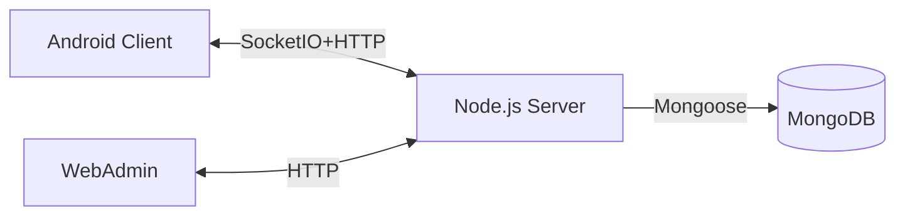

# ChatApp - Fullstack Realtime Messaging & Video Calling

 

---

## Table of Contents
- [Project Overview](#project-overview)
- [Monorepo Structure](#monorepo-structure)
- [Visual Overview](#visual-overview)
- [Features](#features)
- [Technology Stack](#technology-stack)
- [Quick Start](#quick-start)
- [Demo](#demo)
- [API Overview](#api-overview)
- [WebSocket Events](#websocket-events)
- [Database Schema](#database-schema)
- [Realtime Messaging & Calls](#realtime-messaging--calls)
- [Security Features](#security-features)
- [Seeding Admin User](#seeding-admin-user)
- [Production Notes](#production-notes)
- [Scripts](#scripts)
- [Testing](#testing-high-level)
- [Monitoring & Analytics](#monitoring--analytics-optional)
- [Version History](#version-history)
- [Contributing](#contributing)
- [License](#license)
- [Team](#team)
- [Support](#support)
- [Future Work / Limitations](#future-work--limitations)

---

## Project Overview
A **fullstack real-time chat application** with:
- Android native client (Java)
- Node.js backend (Express, WebSocket, Redis, MongoDB)
- Web Admin Panel (React + Vite)
- Features: authentication, friend requests, 1:1 & group chats, file sharing, and video calling.

---

## Monorepo Structure
```
chatapp/
├── server/              # Node.js backend (FastAPI-like with Express)
├── android/             # Android app (Java, WebRTC, Firebase)
├── web-admin/           # React Vite admin panel
├── docs/                # Documentation, diagrams, API references
└── README.md
```

---

## Visual Overview

### Architecture Diagram


---

## Features
- ✅ User Authentication (Firebase + JWT)
- ✅ Friend Requests & Contact List
- ✅ 1:1 & Group Chat with real-time sync
- ✅ File Sharing (images, documents)
- ✅ Voice & Video Calling (WebRTC + Signaling server)
- ✅ Admin Panel (user management, group management, monitoring)
- ✅ Push Notifications

---

## Technology Stack
- **Android Client**: Java, WebRTC
- **Backend Server**: Node.js, Express, Socket.IO, Redis, MongoDB, JWT
- **Admin Panel**: React, Vite, Tailwind, shadcn/ui

---

## Quick Start

### Backend
```bash
cd server
npm install
npm run dev
```

### Android
- Open `android/` in Android Studio
- Configure Firebase project
- Run on emulator or device

### Web Admin
```bash
cd web-admin
npm install
npm run dev
```

---

## Demo
- [Video Demo](docs/demo.mp4)
- 
- 
- 

---

## API Overview
| Endpoint                 | Method | Description                   |
|--------------------------|--------|-------------------------------|
| `/api/auth/register`     | POST   | Register new user             |
| `/api/auth/login`        | POST   | User login (JWT issued)       |
| `/api/users/search`      | GET    | Search users by username/email|
| `/api/friends/request`   | POST   | Send friend request           |
| `/api/friends/accept`    | POST   | Accept friend request         |
| `/api/messages/private`  | POST   | Send private message          |
| `/api/messages/group`    | POST   | Send group message            |
| `/api/call/initiate`     | POST   | Initiate video call           |

---

## WebSocket Events
- `message:new` → Send/receive message
- `friend:request` → Handle friend requests
- `call:offer` / `call:answer` → WebRTC signaling
- `user:online` / `user:offline`

---

## Database Schema
- **Users**: { uid, email, passwordHash, friends[], status }
- **Messages**: { from, to, content, type, timestamp }
- **Groups**: { name, members[], admins[], createdAt }
- **Calls**: { callerId, calleeId, offer/answer, active }

---

## Realtime Messaging & Calls
- Built with **Socket.IO** for reliable messaging.
- **WebRTC** handles P2P video/audio streaming.
- Signaling is managed via backend WebSocket.

---

## Security Features
- JWT Authentication
- Firebase Authentication
- End-to-End encryption (planned)
- Input sanitization
- HTTPS enforced

---

## Seeding Admin User
```bash
cd server
npm run seed:admin
```

---

## Production Notes
- Reverse proxy with Nginx
- HTTPS via Let’s Encrypt
- PM2 for process management
- MongoDB Atlas or local replica set
- Redis for caching / WebSocket presence

---

## Scripts
- `npm run dev` → Development
- `npm run build` → Production build
- `npm run lint` → Code linting
- `npm test` → Run test suite

---

## Testing (High-level)
- **Unit tests** (Jest for server, JUnit for Android)
- **Integration tests** (API endpoints, DB)
- **End-to-end**: WebSocket & video call flows
  
---

## Version History
- v1.0: Initial release (Auth, Chat, Groups, Admin)
- v1.1: Added file sharing, Redis cache
- v1.2: Implemented WebRTC video calling

---

## Contributing
1. Fork the repo
2. Create feature branch (`git checkout -b feature/foo`)
3. Commit changes
4. Push & Create PR

---

## License
 This is a final project for the NT118 course at University of Information Technology (UIT), Vietnam. This project is developed for educational purposes only and is not intended for commercial use.

---

## Team
- Android Client: Nguyen Tai Phu
- Backend (Node.js Server): Nguyen Tai Phu
- Web Admin (React): Nguyen Tai Phu

---

## Support
For any questions or support, feel free to contact: **nguyentaiphu980@gmail.com**

---

## Future Work / Limitations
- End-to-End encryption for messages/calls
- Group video calling
- Multi-device sync
- Push notifications via FCM
- File preview and CDN integration
- Full HTTPS/WSS support for secure communication

